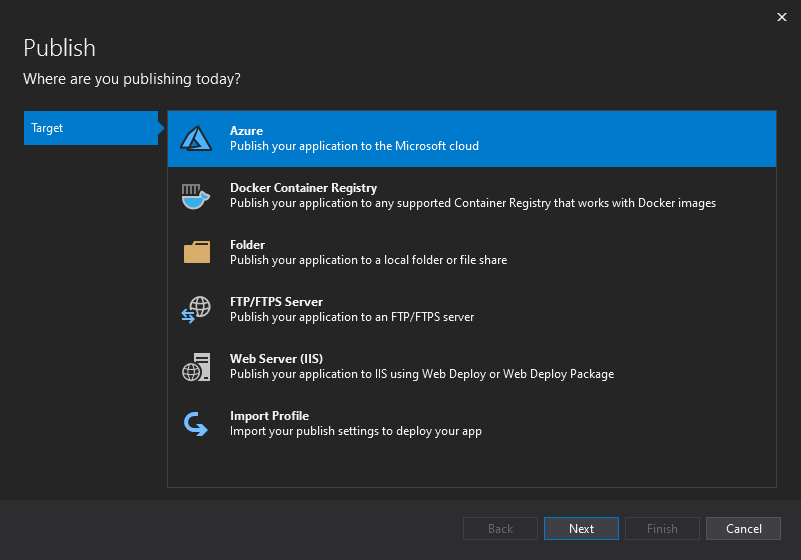
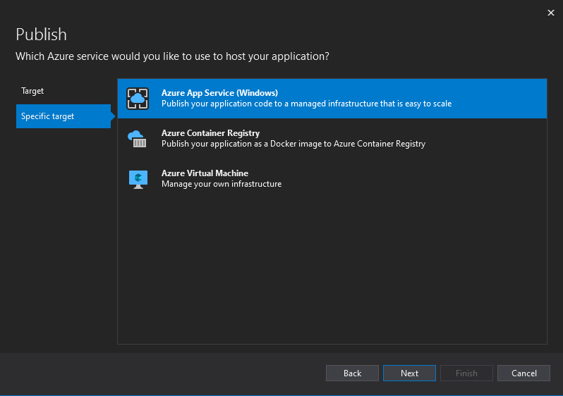
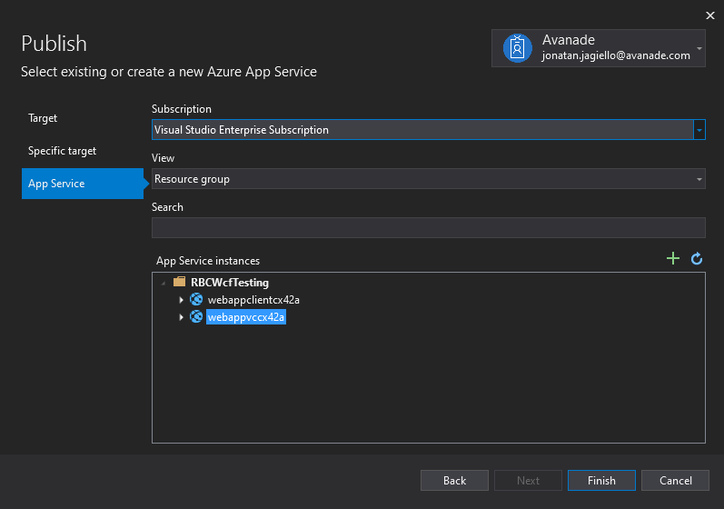
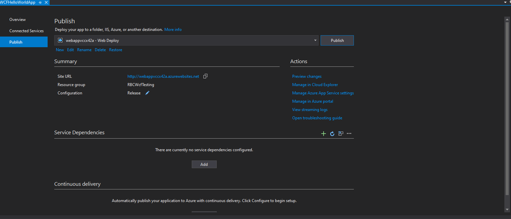

## Infrastructure
You'll need az cli for deployment script to work, [you can get it here](https://docs.microsoft.com/en-us/cli/azure/install-azure-cli-windows?tabs=azure-cli) 
To deploy the infrastructure run following command 
``` powershell
./deployment/deploy.ps1 -SubscriptionId <your azure subscription id>
```

## Publishing app
To publish WCF apps from visual studio:
1. Open VStudio
2. Right click on your WCF project and select publish


3. Choose: Target > Azure > Azure App Service (Windows)




4. Sign in to your Azure account, choose right tenant and subscription (by default it should be Visual Studio Enterprise/Proffessional Subscription)
5. Select correct App Service instance (remember to choose webappsvc for WCF service and webappclient for WCF Client)



6. Click publish with your newly created publishing profile


